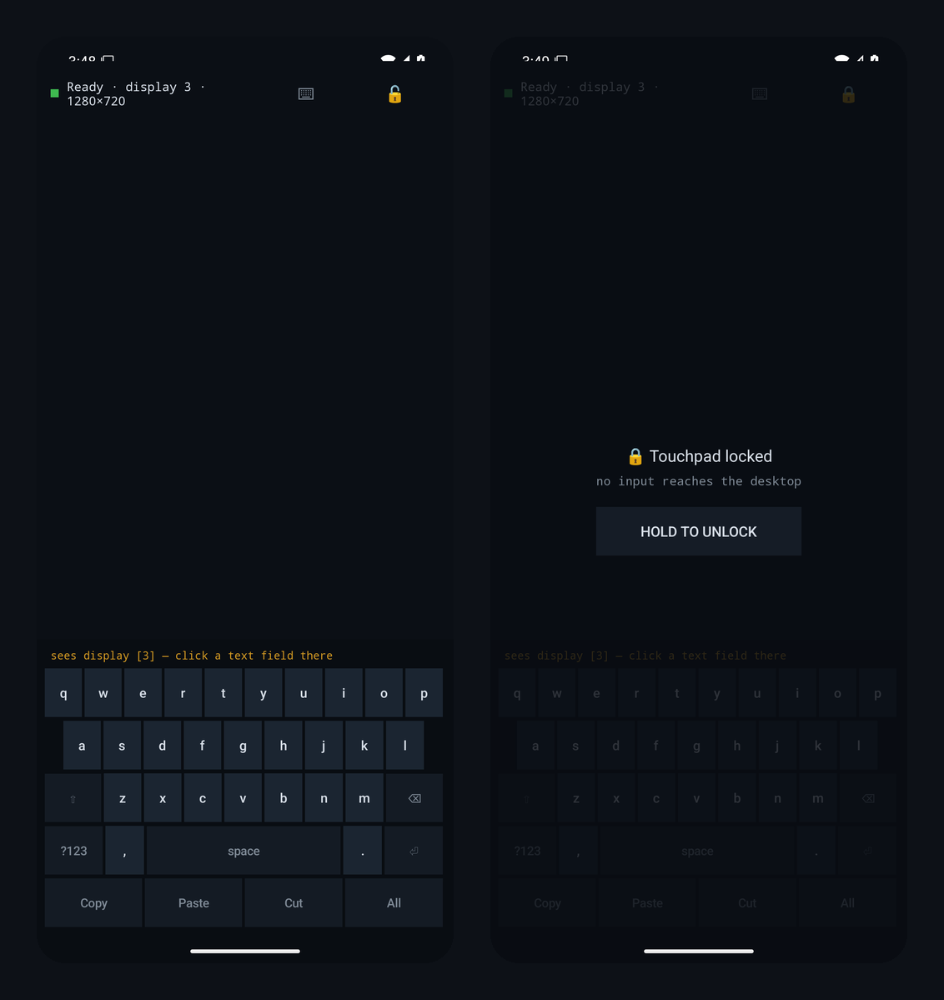

# DeskPad

**Use your phone as a trackpad and keyboard for an external monitor.**

When you connect your Pixel to a monitor over USB-C and switch it to **Desktop mode**, you get a
real desktop — but no built-in way to point and click without carrying a mouse and keyboard. DeskPad
turns the phone's own screen into a **trackpad** (with a cursor drawn on the monitor) and an
**on-screen keyboard** that types into whatever field you click on the desktop.

No mouse, no dongle, no PC, no developer setup. You enable it once and it just works.

> **Status:** tested and working on a Pixel 9 Pro Fold — trackpad, cursor, drag, two-finger scroll,
> keyboard typing, Enter-to-send, and lock/unlock are all confirmed on real hardware.

<p align="center">
  
</p>

<p align="center"><sub>Left: connected (“Ready · display 3”) with the Gboard-style keyboard. Right: locked — no input reaches the desktop until you hold to unlock.</sub></p>

---

## What you need

- An Android phone that supports **Desktop mode** on an external display (e.g. Pixel 9 Pro Fold on
  current Android; requires Android 11 / API 30 or newer).
- A USB-C **DisplayPort** cable and a monitor (or a USB-C hub with HDMI).
- The DeskPad app (`DeskPad-release.apk`).

That's it. **You do not need adb, a rooted phone, Shizuku, or a computer.**

---

## Install

1. Copy `DeskPad-release.apk` to your phone and tap it to install.
   (You may need to allow "Install unknown apps" for your file manager the first time.)
2. Open **DeskPad**.

---

## One-time setup (about 20 seconds)

DeskPad needs one permission: an **Accessibility** service. This is what lets it move a cursor and
tap on the external display.

1. Open DeskPad and **tap the status bar at the top** (it says "Tap here to enable DeskPad in
   Accessibility").
2. In the Accessibility list, choose **DeskPad** and turn it **On**. Confirm the prompt.
3. Return to DeskPad. The dot at the top turns green when it's ready.

You only do this once. The permission **survives reboots** — you never have to set it up again.

There is **no keyboard to enable** — DeskPad types through the same accessibility permission, so once
the service is on, both the trackpad and keyboard work.

---

## Everyday use

1. Connect your phone to the monitor over USB-C and choose **Desktop** when prompted.
2. Open DeskPad. The top bar should read **"Ready · display …"**.
3. The whole phone screen is now your trackpad. A cursor appears on the monitor.

### Trackpad gestures

| Gesture on the phone | What happens on the desktop |
|----------------------|-----------------------------|
| Slide one finger | Move the cursor |
| Tap | Left click |
| Two-finger tap | Right click |
| Two-finger slide | Scroll |
| Tap, then press again and slide | **Grab and drag** (move a window, select text, drag a file) |

The drag follows your finger live — press, then keep sliding, and lift to drop.

### Keyboard

1. Tap the **⌨ keyboard icon** in the top bar to show the keyboard.
2. **Click the text field you want on the desktop first** (with the trackpad) — that's where your
   typing goes.
3. Type. The layout is the familiar Gboard-style keyboard:
   - Letters, with **Shift** and a **?123** symbols page (and a further **=\<** page).
   - **Backspace**, **Space**, and **Enter**.
   - A **Copy / Paste / Cut / All** row for quick editing.
   - Each key gives a little pop-up preview and a haptic tap as you press it.

**Enter actually sends.** In a chat box it presses Send; in a browser address bar or a search box it
submits (Go / Search) — just like a real keyboard's Enter.

### Lock (so nothing happens by accident)

Tap the **🔓 padlock** in the top bar to **lock**. It changes to **🔒**, and a "Touchpad locked"
overlay appears — no taps, drags, scrolls, or keystrokes reach the desktop. This is handy when you
set the phone down. To unlock, press and **hold** the "Hold to unlock" button.

---

## Troubleshooting

- **Top bar says "connect a display (Desktop mode)"** — make sure the monitor is plugged in and you
  chose **Desktop** (not screen mirroring). When it's working the bar shows "Ready · display …".
- **Typing doesn't appear** — click the desktop text field with the trackpad *first*, then type.
  DeskPad types into the field you last clicked.
- **The status dot is orange / "Tap here to enable"** — the accessibility service was turned off
  (some battery optimizers do this). Tap the status bar and turn DeskPad back on.
- **Cursor feels too fast or too slow / scroll too coarse** — these are tunable; see the developer
  notes below.

---

## Is it safe? (privacy & permissions)

DeskPad is deliberately minimal:

- **No internet permission** — it can't send anything anywhere. Everything stays on your phone.
- **No "Display over other apps," no background service, no notifications, no root.**
- The one permission it uses (Accessibility) is scoped to exactly what it needs: dispatching taps to
  the external display and reading/writing the text field you're typing into. It watches **no**
  other accessibility events.
- The cursor is drawn using an accessibility overlay, so it needs no extra "draw over apps"
  permission.

---

## For developers

Project layout: a framework-free `core/` package (pure Kotlin gesture/pipeline/cursor logic, covered
by **33 JUnit unit tests**) with a thin Android layer on top — an `AccessibilityService` that
dispatches gestures and draws the cursor, and an Activity hosting the trackpad + on-screen keyboard.
No third-party runtime dependencies.

```bash
export ANDROID_HOME=/path/to/android-sdk

./gradlew :app:testDebugUnitTest    # run the core unit tests
./gradlew :app:assembleDebug        # -> app/build/outputs/apk/debug/app-debug.apk
./gradlew :app:assembleRelease      # signed release (needs keystore.properties, see below)
```

**Signing:** release signing is loaded from a `keystore.properties` file at the repo root, which is
**gitignored** and not part of this repository. Copy `keystore.properties.example` to
`keystore.properties` and fill in your keystore path and passwords to produce signed release builds.
Without it, debug builds and an unsigned release still build fine.

**Tuning:** cursor sensitivity, scroll step, and drag/tap timings are constants in
`CursorController` and `AccessibilityInputSink` — adjust to taste.

**Design:** see [ARCHITECTURE.md](ARCHITECTURE.md) for how it all fits together — the pure `core/`
pipeline, the accessibility techniques (coordinate-based typing, send-on-Enter, live drag), and the
threading model.

---

## License

Released under the [MIT License](LICENSE) — free to use, modify, and distribute.

*DeskPad is a self-authored app (version 0.2). minSdk 30 · compileSdk 35 · Kotlin.*
